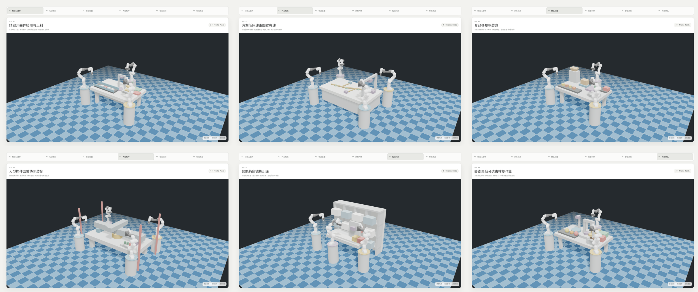
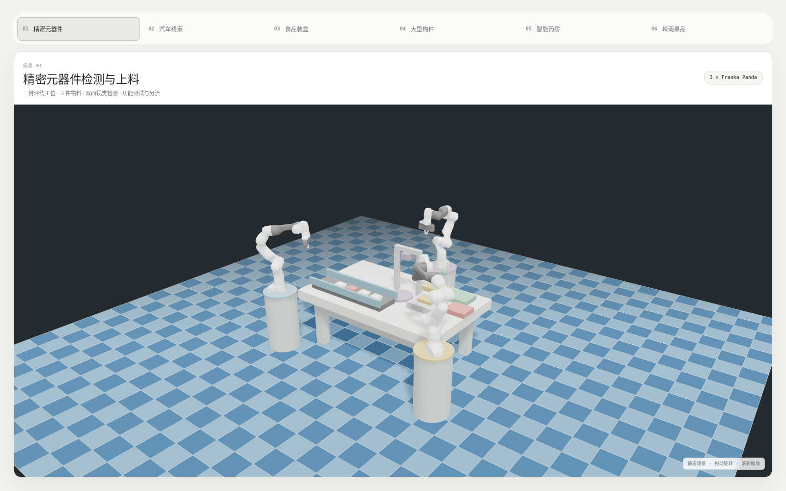
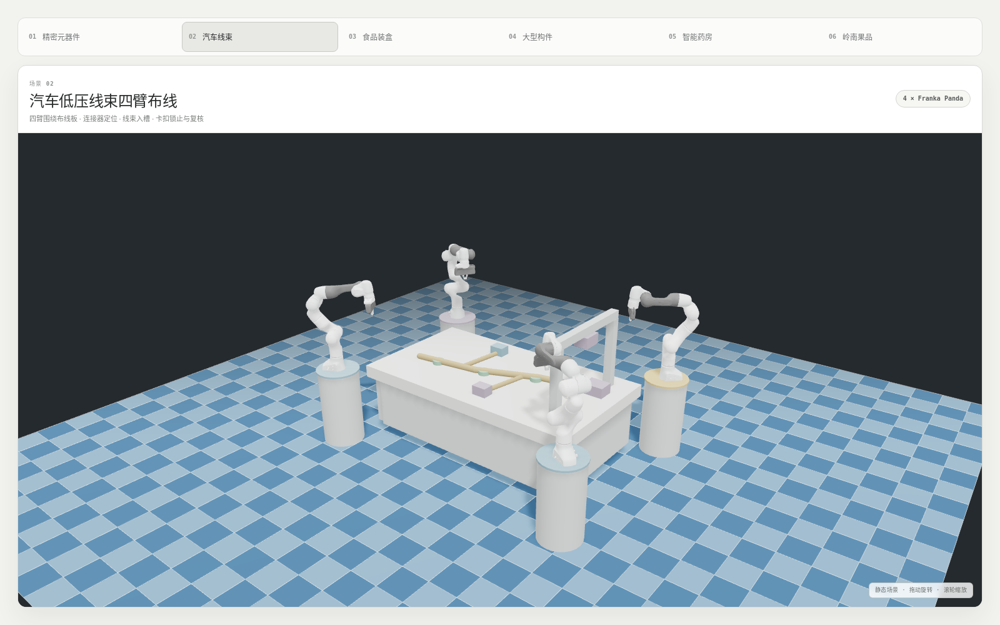
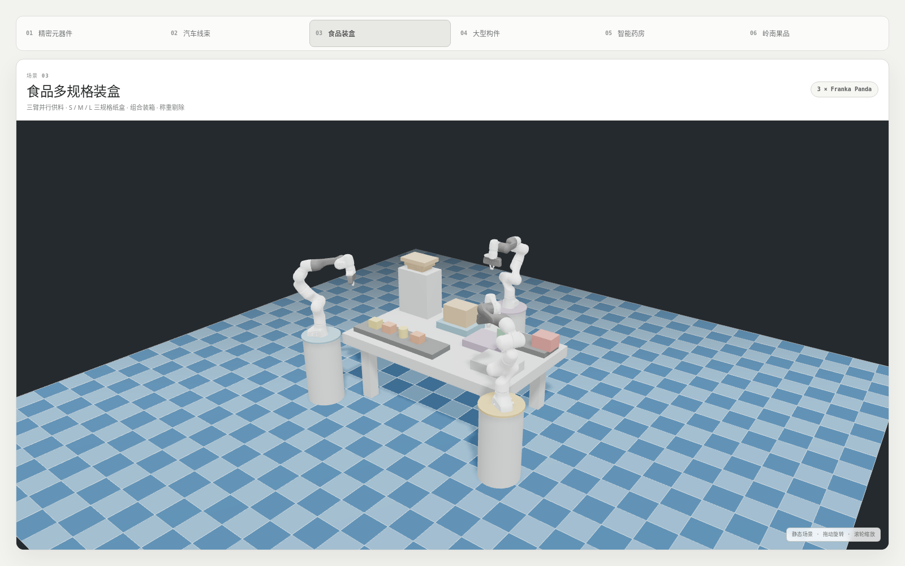
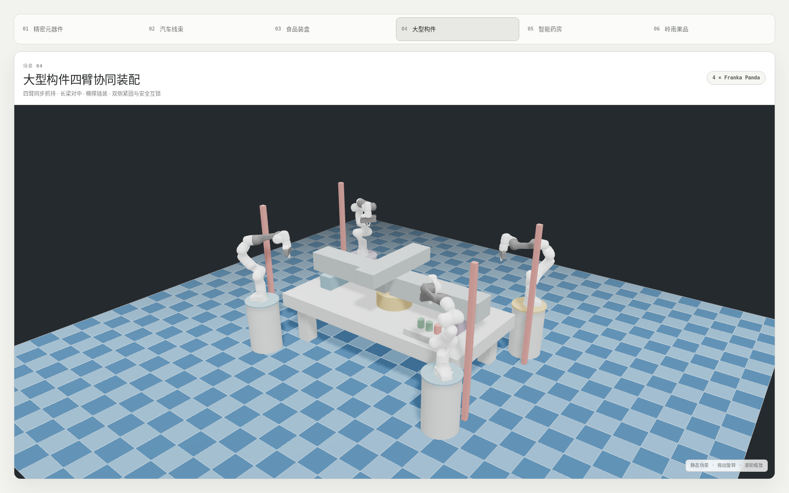
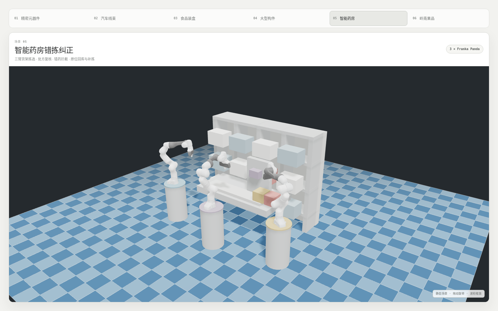
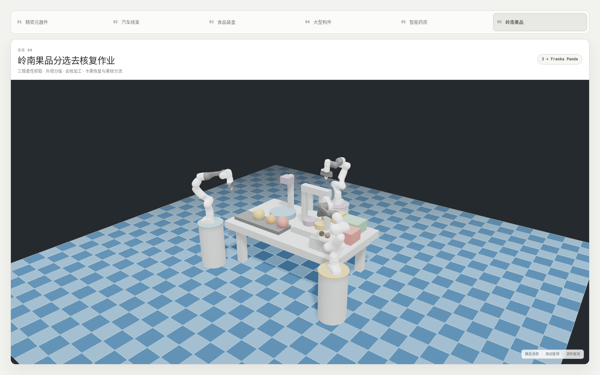

# 多机械臂协作演示平台

基于 React、Three.js、MuJoCo WASM 与真实 Franka Panda MJCF 资产构建的六场景静态 Web 展厅。当前版本只用于工位构型审查：可在浏览器中切换场景、拖动旋转和滚轮缩放，不包含播放或任务执行功能。

在线地址（启用 GitHub Pages 后）：https://shuaijun-liu.github.io/demo/

## 六个场景

| Demo | 工位 | 构型 |
| --- | --- | --- |
| 01 | 精密元器件检测与上料 | 3 × Franka Panda |
| 02 | 汽车低压线束四臂布线 | 4 × Franka Panda |
| 03 | 食品多规格装盒 | 3 × Franka Panda |
| 04 | 大型构件四臂协同装配 | 4 × Franka Panda |
| 05 | 智能药房错拣纠正 | 3 × Franka Panda |
| 06 | 岭南果品分选去核复作业 | 3 × Franka Panda |

## 场景预览

[](project/checkpoints/2026-08-13-supported-fixtures-charcoal-background/README.md)

| 01 精密元器件 | 02 汽车线束 |
| --- | --- |
|  |  |
| 03 食品装盒 | 04 大型构件 |
|  |  |
| 05 智能药房 | 06 岭南果品 |
|  |  |

## 本地运行

需要 Node.js 18.18–18.x。

```bash
npm ci
npm run dev
```

打开终端输出的本地地址。生产构建与预览：

```bash
npm run build
npm run preview
```

## GitHub Pages

仓库已包含 `.github/workflows/deploy-pages.yml`，推送到 `main` 会构建并上传 `dist/`。

首次部署只需在仓库中打开：

1. `Settings → Pages`
2. `Build and deployment → Source`
3. 选择 `GitHub Actions`

随后可访问 https://shuaijun-liu.github.io/demo/ 。Vite 的资源基路径已固定为 `/demo/`，MuJoCo、场景 XML 与 Panda 网格均会从该子路径加载。

## 验证

```bash
npm run test:all
npm run test:scenes
npm run test:static-scenes
npm run test:e2e
```

`test:static-scenes` 使用网页相同的每臂 7 关节 + 1 夹爪初始控制排列执行 MuJoCo 前向计算，并拒绝超过 0.1 mm 的初始穿透。

网页 Panda 将同一刚体上的 Menagerie OBJ 外观碎片无损合并为一个 MuJoCo MSH 网格，10 个视觉文件合计约 2.4 MB，模型依赖请求从 67 个收敛为 22 个；关节、惯量和碰撞网格保持不变。可用纯标准库脚本重新生成：

```bash
python3 scripts/build-web-franka-meshes.py
```

## 当前范围

- 已完成：六套差异化 MJCF 工位、3/4 臂 Franka Panda 构型、Z-up 朝向、场景切换、静态模型加载、白色页面 UI、近黑炭灰主体背景、较深双蓝棋盘格、设备支撑链和初始接触检查。
- 明确不包含：动作播放、物体自动移动、任务状态机、跨臂交接或物理任务演示。

Franka Panda 资产来自 MuJoCo Menagerie，许可证见 `LICENSES/franka-emika-panda-Apache-2.0.txt`。
